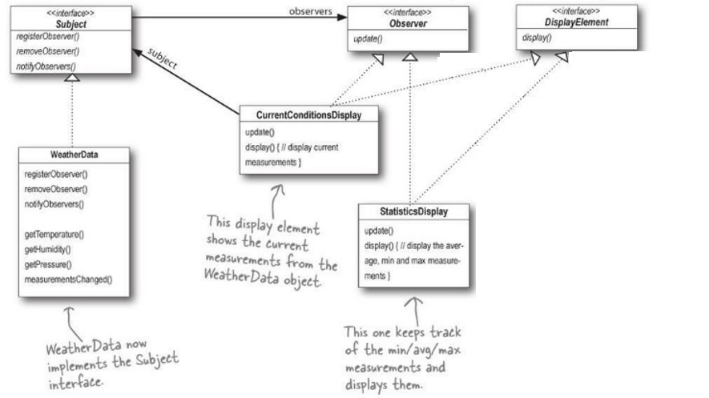

[](https://classroom.github.com/a/s--1lzfk)
# Exam: Completing the Observer Pattern in WeatherStation

## Description

In this exam, we will complete a Weather station service, which constantly send weather data its subscribers. The service is implemented via the Observer design pattern. The architecture is shown below:



The key elements in the design are:
- *WeatherStation.java*: The main test file.
- *WeatherData*: Save the weather revelent data including temperature, humidity, and pressure.
- *Subject.java*: Add / remove observers to an internal array 
- *Observer.java*: Observer interface.
- *DisplayElement.java*: Display interface.

The other two files *StatisticsDisplay.java* and *CurrentConditionDisplay.java* implement the observer and display interface.
The code was adapted from [Head First Design Pattern](https://github.com/bethrobson/Head-First-Design-Patterns). 


## Objective

In this exam there are two main tasks. 

1. You need to complete the 3 functions in *Subject.java*:
   ```java
   public void registerObserver(Observer o) { }
   public void removeObserver(Observer o) { }	
   public void notifyObservers() { }
   ```
   The each function will print 
   ```
   Please remove this line and implement ...
   ```
   by default. Please remove the message and enter your code.


2. You need to complete the `update()` functions in *StatisticsDisplay.java* and *CurrentConditionDisplay.java*.


## Expected Output

The output example of the *CurrentConditionsDisplay* is:

```console
Current conditions: 80.0F degrees and 65.0% humidity
```


The *StatisticsDisplay* shows the average, max and min temperatue. The output example is shown below: 
```console
Avg/Max/Min temperature = 81.0/82.0/80.0
```

The good news is that the output functions have already been implemented. You don't need to modify them. Enjoy the exam!
